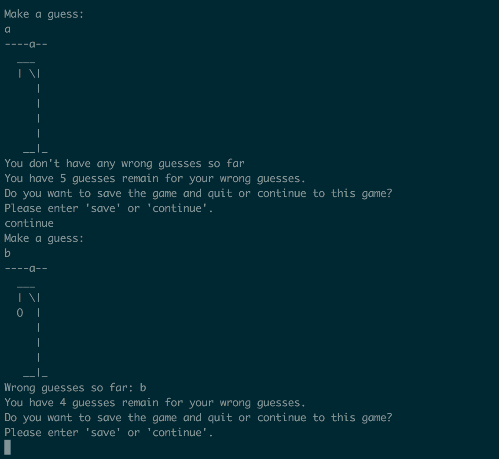

## Asks for new or old game at the beginning.

## Prints the feedbacks

- Wrong guesses so far if there is any
- How many guesses remain
- Whether to save or continue to the game.

## Saves and loads the game.

## If the player wins

## If the player loses

